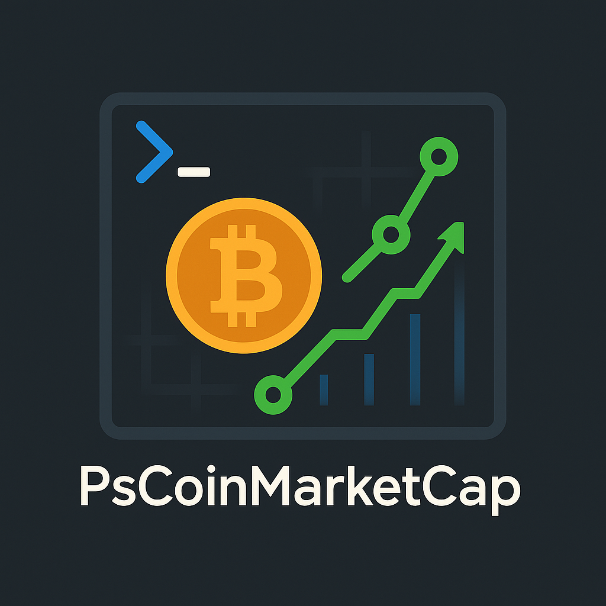

<div align="center">



# 🚀 PsCoinMarketCap

### 💎 The Complete PowerShell Module for CoinMarketCap API v1

**✅ Production Ready • 🚀 16 Functions • 📦 PowerShell Gallery • 🔧 Full Test Coverage**

[](https://www.powershellgallery.com/packages/PsCoinMarketCap)
[](https://www.powershellgallery.com/packages/PsCoinMarketCap)
[](https://github.com/PowerShell/PowerShell)
[](https://jorgeasaurus.github.io/PsCoinMarketCap/)
[](LICENSE)

</div>

---

## 🌐 Quick Links

- 📖 **[Documentation Website](https://jorgeasaurus.github.io/PsCoinMarketCap/)** - Complete documentation and guides
- 📦 **[PowerShell Gallery](https://www.powershellgallery.com/packages/PsCoinMarketCap)** - Download and install
- 📚 **[API Reference](docs/API_REFERENCE.md)** - Complete function reference
- 💰 **[Free Tier Guide](docs/FREE_TIER_GUIDE.md)** - Optimize free API usage

## 📋 Table of Contents

- [✨ Features](#-features)
- [📦 Installation](#-installation)
- [🔑 Getting Started](#-getting-started)
- [💰 Free Tier Guide](#-free-tier-guide)
- [📊 Usage Examples](#-usage-examples)
- [📈 Available Functions](#-available-functions)
- [🔧 Advanced Features](#-advanced-features)
- [📚 Documentation](#-documentation)
- [🤝 Contributing](#-contributing)
- [📄 License](#-license)

## ✨ Features

- 🔐 **Secure API Key Management** - Encrypted storage for API credentials
- 📈 **Real-time Cryptocurrency Data** - Live prices, market caps, and volumes
- 💱 **Currency Conversion** - Convert between 100+ fiat and cryptocurrencies
- 📊 **Data Export** - Export to CSV, JSON, and Excel formats
- 💰 **Stablecoin Support** - Dedicated function for stablecoin data
- 🌍 **Global Market Metrics** - Overall market statistics and trends
- ⚡ **Smart Rate Limiting** - Automatic rate limit management
- 🔄 **Retry Logic** - Exponential backoff for failed requests
- 🧪 **Sandbox Environment** - Test with sandbox API
- 💻 **Cross-Platform** - Windows PowerShell 5.1+ and PowerShell Core 7+

## 📦 Installation

### From PowerShell Gallery (Recommended)

```powershell
# Install the module
Install-Module -Name PsCoinMarketCap -Scope CurrentUser

# Import the module
Import-Module PsCoinMarketCap
```

### From GitHub

```powershell
# Clone the repository
git clone https://github.com/jorgeasaurus/PsCoinMarketCap.git
cd PsCoinMarketCap

# Build and import
.\build.ps1 -Task Build
Import-Module .\Output\PsCoinMarketCap\1.0.0\PsCoinMarketCap.psd1
```

## 🔑 Getting Started

### 1. Get Your API Key

Sign up for a free API key at [CoinMarketCap Pro](https://pro.coinmarketcap.com/signup/).

### 2. Configure Your API Key

```powershell
# Set your API key (session only)
Set-CMCApiKey -ApiKey "your-api-key-here"

# Or store permanently (encrypted)
Set-CMCApiKey -ApiKey "your-api-key-here" -Scope User

# Verify configuration
Get-CMCApiKey
```

### 3. Start Using the Module

```powershell
# Get top 10 cryptocurrencies
Get-CMCListings -Limit 10

# Get Bitcoin price
Get-CMCQuotes -Symbol "BTC"

# Get global market overview
Get-CMCGlobalMetrics
```

## 💰 Free Tier Guide

The CoinMarketCap free tier is perfect for personal use and includes:

### What's Included
- ✅ **10,000 API calls/month**
- ✅ **All core endpoints**
- ✅ **Real-time data** (5-minute cache)
- ✅ **Single currency conversion**

### Limitations
- ❌ Multiple currency conversions (requires paid plan)
- ❌ Historical data access
- ❌ Advanced analytics
- ❌ Commercial usage rights

### Free Tier Best Practices

```powershell
# ✅ GOOD: Single currency, batch requests
$top50 = Get-CMCListings -Convert "USD" -Limit 50
$portfolio = Get-CMCQuotes -Symbol "BTC","ETH","ADA" -Convert "USD"

# ❌ BAD: Multiple currencies (requires paid plan)
# Get-CMCListings -Convert "USD","EUR","GBP"
```

## 📊 Usage Examples

### Get Top Cryptocurrencies

```powershell
# Get top 20 by market cap
$top20 = Get-CMCListings -Convert "USD" -Limit 20
$top20 | Format-Table Name, Symbol, USD_price, USD_market_cap -AutoSize
```

### Track Your Portfolio

```powershell
# Define your holdings
$myCoins = @("BTC", "ETH", "ADA", "DOT", "LINK")

# Get current prices
$portfolio = Get-CMCQuotes -Symbol $myCoins -Convert "USD"

# Display portfolio value
$portfolio | Select-Object Name, Symbol, 
    @{N="Price";E={[math]::Round($_.USD_price, 2)}},
    @{N="24h Change %";E={[math]::Round($_.USD_percent_change_24h, 2)}}
```

### Get Stablecoins

```powershell
# Get top stablecoins
$stablecoins = Get-CMCStablecoins -Limit 10 -Convert "USD"
$stablecoins | Format-Table Name, Symbol, USD_price, USD_market_cap -AutoSize

# Sort by volume
$topVolume = Get-CMCStablecoins -Sort "volume_24h" -Limit 5
```

### Convert Cryptocurrency

```powershell
# Convert 1 Bitcoin to USD
$btcPrice = Convert-CMCPrice -Amount 1 -Symbol "BTC" -Convert "USD"
Write-Host "1 BTC = $$($btcPrice.quote.USD.price) USD"

# Convert 100 USD to ETH
$ethAmount = Convert-CMCPrice -Amount 100 -Id 1027 -Convert "ETH"
```

### Export Market Data

```powershell
# Export to CSV
Get-CMCListings -Limit 100 | Export-CMCData -Path "crypto_market.csv"

# Export to JSON with metadata
Get-CMCQuotes -Symbol "BTC","ETH" | 
    Export-CMCData -Path "portfolio.json" -Format JSON -IncludeMetadata

# Export to Excel (requires ImportExcel module)
Get-CMCListings -Limit 50 | 
    Export-CMCData -Path "market_data.xlsx" -Format Excel
```

### Monitor Market Trends

```powershell
# Get trending cryptocurrencies
$trending = Get-CMCTrending -Limit 10
$trending | Format-Table Name, Symbol, cmc_rank -AutoSize

# Get top gainers and losers
$movers = Get-CMCGainersLosers -Limit 10
Write-Host "`n📈 TOP GAINERS:" -ForegroundColor Green
$movers.gainers | Format-Table Name, USD_percent_change_24h

Write-Host "`n📉 TOP LOSERS:" -ForegroundColor Red
$movers.losers | Format-Table Name, USD_percent_change_24h
```

## 📈 Available Functions

### Authentication (2)
- `Set-CMCApiKey` - Configure API authentication
- `Get-CMCApiKey` - Retrieve stored API key

### Cryptocurrency Data (11)
- `Get-CMCListings` - Latest cryptocurrency listings
- `Get-CMCQuotes` - Real-time quotes for specific cryptos
- `Get-CMCInfo` - Detailed cryptocurrency metadata
- `Get-CMCMap` - Complete ID mapping
- `Get-CMCMarketPairs` - Trading pairs information
- `Get-CMCOHLCV` - OHLCV data
- `Get-CMCStablecoins` - Stablecoin-specific data
- `Get-CMCCategories` - Cryptocurrency categories
- `Get-CMCTrending` - Trending cryptocurrencies
- `Get-CMCGainersLosers` - Top market movers

### Global Metrics (1)
- `Get-CMCGlobalMetrics` - Global market statistics

### Tools & Utilities (2)
- `Convert-CMCPrice` - Currency conversion calculator
- `Export-CMCData` - Export data to various formats

## 🔧 Advanced Features

### Rate Limit Management

```powershell
# Check API usage
$keyInfo = Get-CMCKeyInfo
Write-Host "Daily credits remaining: $($keyInfo.credit_count_remaining)"
Write-Host "Monthly limit: $($keyInfo.credit_count_monthly_limit)"
```

### Error Handling

```powershell
try {
    $data = Get-CMCQuotes -Symbol "BTC" -ErrorAction Stop
} catch {
    Write-Warning "API call failed: $_"
    # Module automatically retries with exponential backoff
}
```

### Filtering and Sorting

```powershell
# Filter by market cap
$largeCap = Get-CMCListings -MarketCapMin 1000000000 -Limit 50

# Sort by 24h volume
$topVolume = Get-CMCListings -Sort "volume_24h" -SortDirection "desc"

# Filter by price range
$midRange = Get-CMCListings -PriceMin 10 -PriceMax 100
```

## 📚 Documentation

- 📖 [API Reference](docs/API_REFERENCE.md) - Detailed command documentation
- 💎 [Free Tier Guide](docs/FREE_TIER_GUIDE.md) - Maximize your free API usage
- 🔧 [Developer Guide](CLAUDE.md) - Module architecture and development
- 📋 [Changelog](CHANGELOG.md) - Version history and updates
- 🚀 [Deployment Guide](DEPLOYMENT_GUIDE.md) - Publishing to PSGallery

### Getting Help

```powershell
# Get help for any command
Get-Help Get-CMCListings -Full

# See examples
Get-Help Get-CMCQuotes -Examples

# List all commands
Get-Command -Module PsCoinMarketCap
```

## 🤝 Contributing

Contributions are welcome! Please feel free to submit a Pull Request.

1. Fork the repository
2. Create your feature branch (`git checkout -b feature/AmazingFeature`)
3. Commit your changes (`git commit -m 'Add some AmazingFeature'`)
4. Push to the branch (`git push origin feature/AmazingFeature`)
5. Open a Pull Request

### Development Setup

```powershell
# Install development dependencies
Install-Module -Name Pester, PSScriptAnalyzer, InvokeBuild -Scope CurrentUser

# Run tests
.\build.ps1 -Task Test

# Run full CI pipeline
.\build.ps1 -Task CI
```

## 📄 License

This project is licensed under the MIT License - see the [LICENSE](LICENSE) file for details.

## 🙏 Acknowledgments

- 💎 [CoinMarketCap](https://coinmarketcap.com/) for providing the API
- 🚀 PowerShell community for feedback and support
- 🤖 Built with assistance from Claude

## ⚠️ Disclaimer

This module is not affiliated with, endorsed by, or sponsored by CoinMarketCap. Use at your own risk. Cryptocurrency investments carry significant risk. Always do your own research.

---

<div align="center">

**Made with ❤️ for the PowerShell Community**

⭐ **Star this repo if you find it useful!** ⭐

[Report Issues](https://github.com/jorgeasaurus/PsCoinMarketCap/issues) • [Request Features](https://github.com/jorgeasaurus/PsCoinMarketCap/issues) • [Discussions](https://github.com/jorgeasaurus/PsCoinMarketCap/discussions)

</div>